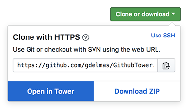

**Clone to Tower for Github** is a lightweight browser extension that links Github's "Open in Desktop" button to [Tower.app](http://www.git-tower.com) without the need of ever installing the Github Desktop Application. The extension is available for Chrome and Safari.

# Installation

### Chrome
Install the Extension from the [Chrome Web Store](https://chrome.google.com/webstore/detail/github-tower/ipgffdnnaanlcjlmpmmllieefmfjcbml) by clicking "Add to Chrome".

### Safari
Install the Extenstion from the [Safari Extensions Gallery](https://safari-extensions.apple.com/details/?id=de.dreamlab.githubtower-R448YUR7UE) by clicking "Install now". 

# Rationale
Github's "Open in Desktop" button only works if you are logged in to your account with the Github Desktop Application. Logged out users can not use the "Open in Desktop" button. At this point in time Tower also does not register the right URL scheme. The scheme Github links to depends on the last used version of Github's desktop application.

This browser extensions eliminates the need to be logged into Github and the Github Desktop Application by running [23 lines of code](https://github.com/gdelmas/GithubTower/blob/master/src-safari/GithubTower.safariextension/main.js) only on Github's website.

# Tower
Tower 2 is a wonderful Git client for OS X. It brings all of Git’s powerful features to your desktop. Try it out here: [http://www.git-tower.com](http://www.git-tower.com)
